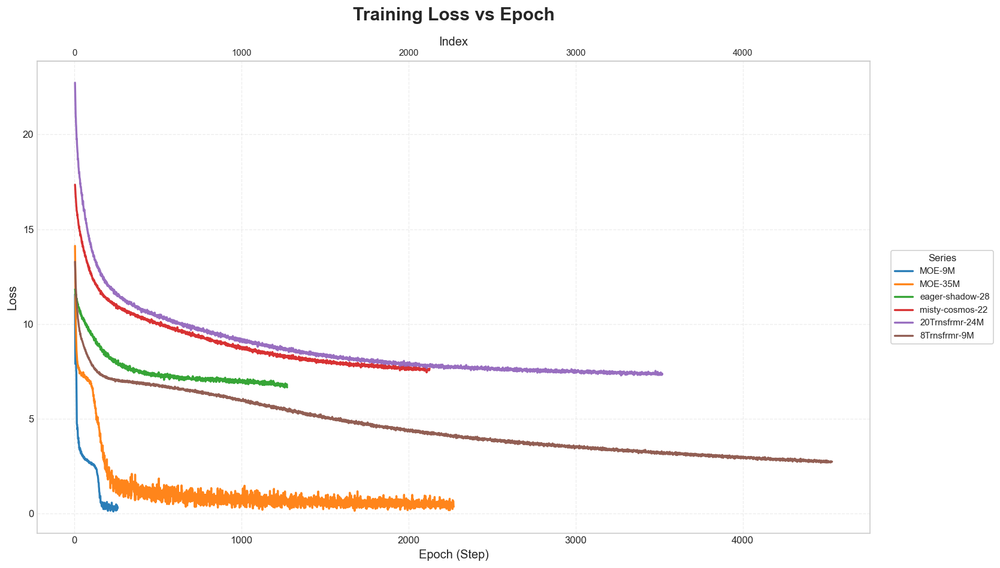
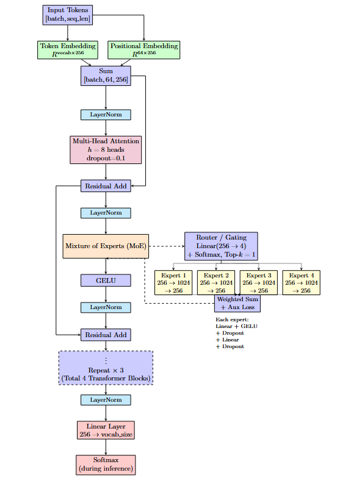
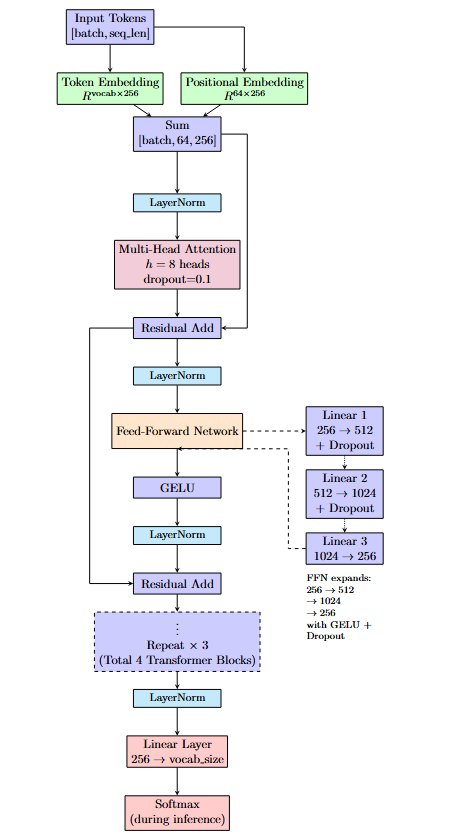

# JAX‑AttentionNet: Model comparison and LLM architecture

This repository provides compact, practical building blocks for attention‑based models in JAX/Flax and an at‑a‑glance comparison of training loss across several model variants. The goal is to make it easy to reason about convergence behavior and the architectural trade‑offs between dense Transformers and Mixture‑of‑Experts (MoE) designs.

## Repository layout

- `Attention.py` — Core attention module in JAX/Flax (scaled dot‑product attention and multi‑head attention utilities).
- `Transformer.py` — Minimal Transformer blocks wiring attention, MLP, and residual connections.
- `flax_attention.ipynb` — A notebook version to experiment with attention interactively (great for step‑by‑step demos or profiling).
- `losses_vs_epoch.png` — The generated figure (embedded below in this README).

## The loss comparison figure

Below is the curated plot synthesizing the loss curves for several model variants as training progresses (x‑axis is step/epoch). A secondary x‑axis at the top shows the raw index for quick cross‑referencing.

What you’re seeing:

- Each line is a model/experiment series, e.g., “MOE‑9M”, “MOE‑35M”, “eager‑shadow‑28”, “misty‑cosmos‑22”, “20Trnsfrmr‑24M”, “8Trnsfrmr‑9M”.
- Runs have different lengths; the figure trims trailing gaps so the lines remain uninterrupted and easy to compare.

## Architecture diagrams

The figures below illustrate the two block variants used in our comparisons. The first replaces the dense feed‑forward with a routed Mixture‑of‑Experts (MoE); the second shows a standard dense Transformer block with a 3‑layer FFN expansion.

1) Mixture‑of‑Experts (MoE) block with router/gating and top‑k experts:

2) Multi‑Head Attention Transformer block with dense FFN (GELU) expansion:

## Key observations from the loss curves

The figure enables a qualitative comparison across families of models that also appear in the Jupyter notebook exploration:

1) Mixture‑of‑Experts (MoE) vs. dense Transformers
- The MoE runs (e.g., “MOE‑9M”, “MOE‑35M”) generally exhibit faster initial loss descent (steeper early slope) and reach a lower training‑loss floor over the observed window. This is consistent with MoE’s higher conditional capacity: more parameters are available, but only a subset of experts is activated per token.
- Larger MoE variants (e.g., “MOE‑35M”) often stabilize with smoother curves after the warm‑up, reflecting improved capacity to model long‑tail patterns without proportionally increasing per‑token compute.

2) Dense baselines and smaller Transformers
- Dense runs such as “8Trnsfrmr‑9M” typically show steady, smooth convergence; they can be strong on smaller budgets and are simpler to train, but may plateau at higher loss compared to MoE at similar compute.
- Heavier dense variants (e.g., “20Trnsfrmr‑24M”) may require more careful optimization (schedule/warmup/batch size) to realize their potential; without tuned settings, their loss curves can remain comparatively elevated in the same training horizon.

3) Miscellaneous baselines
- Exploratory or ablation runs like “eager‑shadow‑28” and “misty‑cosmos‑22” illustrate different optimization and regularization choices; their plateaus and wiggles offer a quick lens on stability and learning‑rate sensitivity.

4) Convergence heuristics
- Slope (speed): Early steep descent indicates strong signal capture; flattening suggests either capacity or optimization bottlenecks.
- Floor (final loss): Lower floors suggest better fit on the observed data distribution.
- Smoothness (stability): High variance can indicate insufficient batch size, too‑aggressive LR, or inadequate normalization.

## LLM/Transformer architecture described

The models compared in the figure follow the standard Transformer/LLM blueprint with minor variations. At a high level:

1) Tokenization and embeddings
- Discrete tokens map to embeddings; optional learned or sinusoidal positional encodings are added to inject order information.

2) Stacked Transformer blocks (pre‑norm)
- LayerNorm → Multi‑Head Attention → Residual → LayerNorm → Feed‑Forward Network (often 4× expansion) → Residual.
- Causal/attn masks are applied for autoregressive setups.

3) Multi‑Head Attention (MHA)
- Queries, Keys, Values are projected from the hidden state, split into multiple heads, attention weights are computed via scaled dot‑product, then head outputs are concatenated and projected back.

4) Feed‑Forward Network (FFN)
- Typically two linear layers with a nonlinearity (GELU/GEGLU/SwiGLU). Dropout may be applied for regularization.

5) Mixture‑of‑Experts (MoE) variants
- The FFN is replaced by an expert pool: a router (gating network) selects top‑k experts per token; only those experts are executed. Load‑balancing losses encourage even expert utilization, improving throughput and generalization. This yields high parameter count but constant per‑token compute.

6) Output head
- A final projection to vocabulary logits for language modeling, or task‑specific heads for other modalities.

Implementation locations in this repo:
- `Attention.py` — Attention primitives and multi‑head attention.
- `Transformer.py` — Transformer block wiring and model composition.
- `flax_attention.ipynb` — Notebook exploration of attention internals (e.g., masking, head shapes, and debugging utilities).

## Mathematical essentials (for context)

Scaled dot‑product attention with an additive mask $M$:

$$
	ext{Attention}(Q, K, V) = \text{softmax}\!\left(\frac{QK^{\top}}{\sqrt{d_k}} + M\right) V.
$$

Multi‑Head Attention (MHA) composition:

$$
	ext{MHA}(X) = \text{Concat}(\text{head}_1, \dots, \text{head}_h) W^O.
$$

## Typical training loop (conceptual)

Although this repo focuses on the attention components and visualization, a standard Flax training step generally:

1. Computes logits via the Transformer.
2. Calculates loss (e.g., cross‑entropy) and metrics.
3. Uses `nnx.value_and_grad` to obtain gradients.
4. Applies updates with an optimizer (Optax is commonly used).
5. Logs metrics every N steps — these logs are what ultimately produce.

## Practical tips for better curves

- Warm‑up and cosine decay schedules help reduce early‑training volatility.
- Label smoothing can improve calibration and slightly lower loss floors.
- Gradient clipping (e.g., global norm) stabilizes large‑model training.
- For MoE: tune router capacity factor and load‑balancing loss; monitor expert utilization histograms.

## Dependencies (high level)

- For modeling: `jax`, `jaxlib`, `flax` (and typically `optax` for optimization)
- For visualization: `matplotlib`, `pandas` (used by the included plot script)

## Troubleshooting

- “No module named 'matplotlib' or 'pandas'”: install the packages as shown above.
- Empty figure or missing lines: ensure your CSV has columns ending in `" - loss"` and that values are numeric.
- Mixed run lengths: some series may stop early; the script drops trailing NaNs so the render remains clean.

## License

If you plan to open‑source this work, add your license here (e.g., Apache‑2.0 or MIT). Otherwise, treat the code as all rights reserved.

## Citation

If this repository helps your work, consider citing it or linking back in your project notes.

